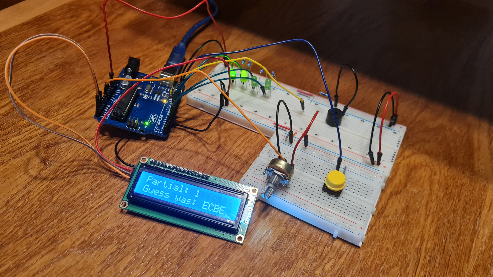

# Proiectarea cu Microprocesoare - Proiect

Nume: Preda Andrei  
Grupa: 331 CA

## Tema proiectului

Proiectul își propune implementarea unei clone a jocului de societate
"Mastermind".

## Organizare

Codul este structurat în următoarele module:

- `Main`: un modul ce implementează logica principală a programului
- `Songs`: un modul pentru interacțiunea cu melodiile programului
- `Pitches.h`: un header cu constante pentru note muzicale.

